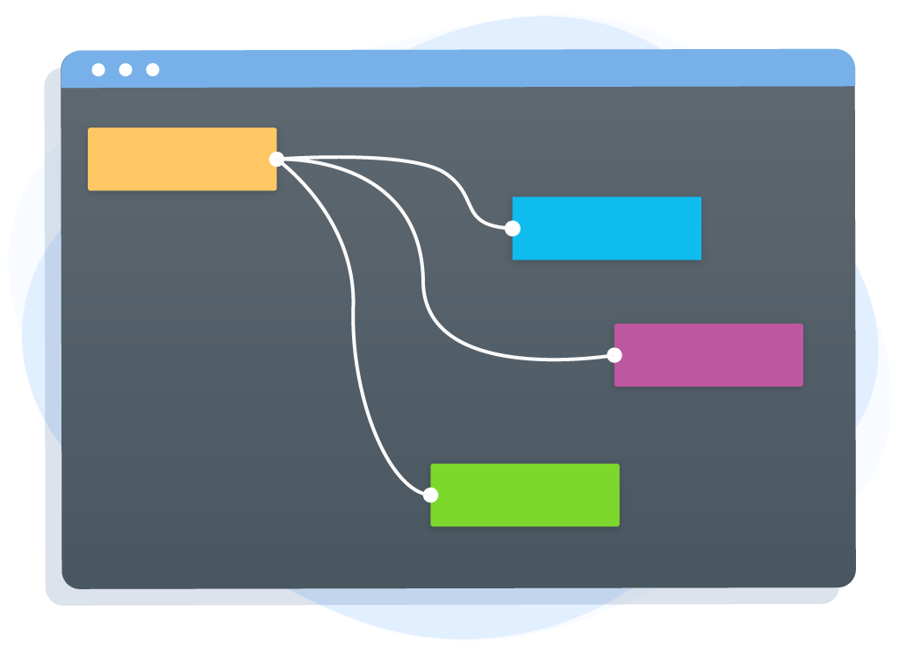

  

    
  

 

  

    A tiny collection of lightweight React components for building diagrams with ease
  

  

    <a href="https://beautifulinteractions.github.io/beautiful-react-diagrams/" target="_blank">
    🌟 Live playground here 🌟
    </a>
  

## 💡 Why?

Javascript diagramming libraries are often difficult to integrate in React projects.  
Different patterns not always fit the React nature and having a component's state in in sync with an external
diagramming library might be quite difficult especially when the latter had been built in a different paradigm (such as MVC, for example).

For this reason we created `beautiful-react-diagrams` an easy-to-customise functional diagramming library to build 
diagrams with ease.

## 🎓 Principles

- **Lightweights**: import nothing but a single lightweight javascript.
- **Controlled components**: exports [controlled](https://reactjs.org/docs/forms.html#controlled-components) components only.
- **Renderers**: the involved components can be easily replaced with your own by using the  `renderer` props.
- **Easy to style**: built using CSS vars only.

## ☕️ Features

* Concise API
* Small and lightweight
* Easy to use
* Easy to customise

  

    <a href="https://beautifulinteractions.github.io/beautiful-react-diagrams/" target="_blank">
    🌟 Live playground here 🌟
    </a>
  

## Contributing

Contributions are very welcome and wanted. 

To submit your custom pull request, please make sure your read our [CONTRIBUTING](./CONTRIBUTING.md) guidelines.

**Before submitting** a new pull request, please make sure:

1. You have updated the package.json version and reported your changes into the [CHANGELOG](./CHANGELOG.md) file
3. make sure you run `npm run lint`, `npm build` and then `npm test` before submitting your merge request.
4. make sure you've added the documentation of your changes.
5. if you've changed the signature of a component, please make sure you've updated the `index.d.ts` file.

### Credits

This library is provided and sponsored by: 

  

    
  

As part of our commitment to support and contribute to the open source community.

---

Icon made by [Freepik](https://www.flaticon.com/authors/freepik) from [www.flaticon.com](https://www.flaticon.com/free-icon/hook_1081812)
